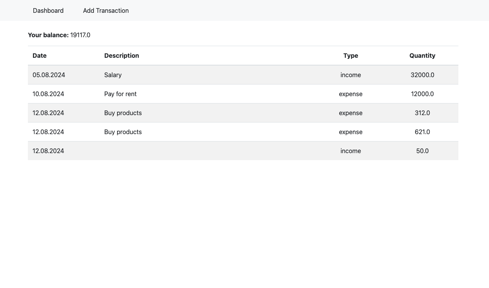
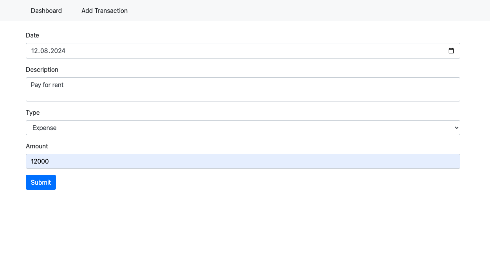

# Personal Finance Tracker

Version: 1.0.0

Technologies:
- Python
- Flask
- Flask WTF
- Jinja2
- SQLite
- SQLAlchemy
- Bootstrap 4

Using this tool you can see all your incomes and expenses.

Dashboard:

Add transaction page:

